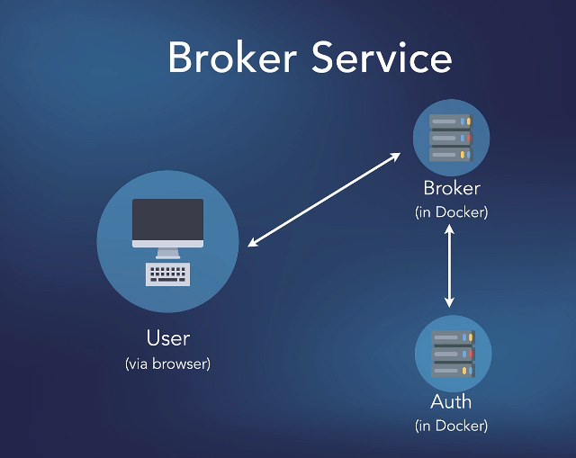
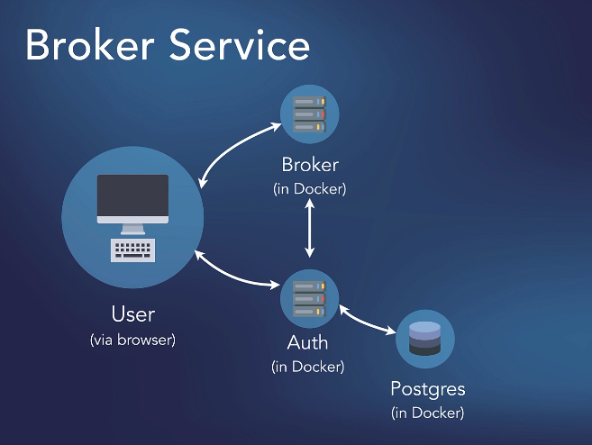
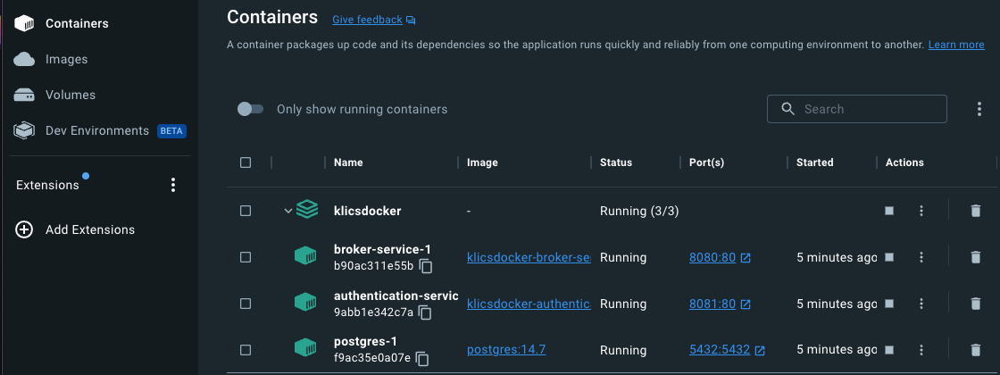
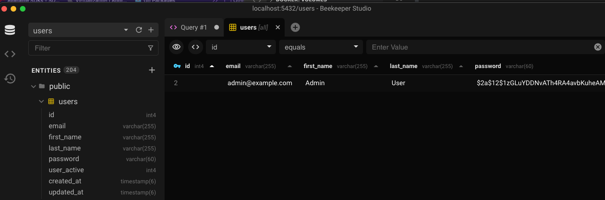

# Microservices with GO

## Bulding a simple front end and a microservice


**Feature:** Setup a a micro service called broker

    Scenario: I want to create a "broker-service"

    Scenario: I want to broker-service as a docker image to run in a docker container

    Scenario: Any code changes made to broker-service should automatically compile into a new docker image

**Feature:** Front-end interacrtion with broker-service

    Scenario: And I want to be able to modify the front-end to interact with broker-service

        When Front-end sends a request to broker-service

        And Broker-service processes the request

        And broker-service sends "some response" back

        Then I should see "some response" in the test-page

## Initial project structure


The workspace `GOMICRO` is saved at the root of our project folder

### Initialize GIT repository for version control

    ```bash
    git init
    git remote add origin git@github.com:cicio/MicroservicesGo.git
    git branch -U main
    git push -u origin main

    ```

Each service will be hosted in its separate folder and opened into the workspace. This will allow us to have all folders open at the same time

`go.mod` content shows that we are using go 1.18 version

**NOTE** research about upgrading to `go 1.20`

## The front-end

### The main.go file

    ```go
    http.HandleFunc("/", func(w http.ResponseWriter, r *http.Request) {
            render(w, "test.page.gohtml")
        })

    ```

We have one handler `HandleFunc`("/" ...)`

And as you can see in my main function, I define a handler and of course there's only one handler because there's only one page on this particular site.

Any time someone hits slash, the root level of this application, I'm going to call a render function that renders the template named `test.page.gohtml` and that's found inside the `template` folder

### The test.page.gohtml

This uses the template base, which puts a header in here and it puts a footer down below everything else

`{{template "base" .}}`

And the content here is just simple HTML

`{{define "content"}}`

I'm using bootstrap and I have a `div` with the class of container.

Then I have one row and one column and at the top I have the title `Test microservices`, then a horizontal rule.

    ```go

        <div class="container">
                <div class="row">
                    <div class="col">
                        <h1 class="mt-5">Test microservices</h1>
                        <hr>
    ```

Then div id that says output. output shows here.

    ```
    <div id="output" class="mt-5" style="outline: 1px solid silver; padding: 2em;">
                    <span class="text-muted">Output shows here...</span>
                </div>
    ```

Obviously, we're going to change that using JavaScript.

And then I have two other windows or two little dialogs or boxes, one that shows what I'm sending and

    ```
     <div class="row">
            <div class="col">
                <h4 class="mt-5">Sent</h4>
                <div class="mt-1" style="outline: 1px solid silver; padding: 2em;">
                    <pre id="payload"><span class="text-muted">Nothing sent yet...</span></pre>
                </div>
            </div>
            <div class="col">
                <h4 class="mt-5">Received</h4>
                <div class="mt-1" style="outline: 1px solid silver; padding: 2em;">
                    <pre id="received"><span class="text-muted">Nothing received yet...</span></pre>
                </div>
            </div>
        </div>

    ```

one that shows what I'm receiving.

So that's simple HTML.

### The render function on the main.go file

    ```go
    func render(w http.ResponseWriter, t string) {

    partials := []string{
        "./cmd/web/templates/base.layout.gohtml",
        "./cmd/web/templates/header.partial.gohtml",
        "./cmd/web/templates/footer.partial.gohtml",
    }

    var templateSlice []string
    templateSlice = append(templateSlice, fmt.Sprintf("./cmd/web/templates/%s", t))

    for _, x := range partials {
        templateSlice = append(templateSlice, x)
    }

    tmpl, err := template.ParseFiles(templateSlice...)
    if err != nil {
        http.Error(w, err.Error(), http.StatusInternalServerError)
        return
    }

    if err := tmpl.Execute(w, nil); err != nil {
        http.Error(w, err.Error(), http.StatusInternalServerError)
    }


    ```

Once we have that slice of strings,

    ```go
    partials := []string{
        "./cmd/web/templates/base.layout.gohtml",
        "./cmd/web/templates/header.partial.gohtml",
        "./cmd/web/templates/footer.partial.gohtml",
    }
    ```

 we declare a variable called template slice, which is a slice of strings and we append whatever we received as an argument here called T for template.

    ```go
    var templateSlice []string
    templateSlice = append(templateSlice, fmt.Sprintf("./cmd/web/templates/%s", t))
    ```

We append that to this slice.

    ```go
    for _, x := range partials {
        templateSlice = append(templateSlice, x)
    }
    ```

So when I render that one page, it'll have based on layout HTML plus the header, plus the footer,

plus the name of the template that this function received.

And of course that was test.page.gohtml

Then all I do is pass those files using the template slices in argument, a veriadic parameter and I execute the template

    ```go
    tmpl, err := template.ParseFiles(templateSlice...)
    if err != nil {
        http.Error(w, err.Error(), http.StatusInternalServerError)
        return
    }

    if err := tmpl.Execute(w, nil); err != nil {
        http.Error(w, err.Error(), http.StatusInternalServerError)
    }

    ```

### The rendered test.page

Here is the view of the rendered test microservice page
run following command on the terminal

    ```bash
        go run ./cmd/web
    ```

    It should print out:
    
    `starting front end service on port 8081`


## Creating the broker-service

From the project rot folder `MicroservicesGo` create a new `broker-service` folder
run following command from terminal

    ```bash
    cd broker-service
    go mod init github.com/cicio/Microservices/broker
    
    

    ```

### Folder structure

    ```bash
    Microservices
        broker-service
            cmd
                api
                    main.go
    ```

### First steps to creat the broker service

1. Has one route `"/"`

2. The top level of the application will work. It should accept Jason payload

3. Do something with it and then respond saying, `yeah, I've got the response`.

4. It should enable connection from the front end to the broker service

Get some third party library for routing

    ```go
        go get github.com/go-chi/chi/v5
        go get github.com/go-chi/chi/v5/middleware
        go get github.com/go-chi/cors
    ```

    Create a `routes.go` file that will host all routes for the application

    ```go
        func routes() http.Handler {

            mux := chi.NewRouter()

            //specify who is alloed to connect
            mux.Use(cors.Handler(cors.Options{
                AllowedOrigins:   []string{"https://*", "http://*"},
                AllowedMethods:   []string{"GET", "POST", "PUT", "DELETE", "OPTIONS"},
                AllowedHeaders:   []string{"Accept", "Authorization", "Content/Type", "X-CSRF-Token"},
                ExposedHeaders:   []string{"Link"},
                AllowCredentials: true,
                MaxAge:           300,
            }))

            mux.Use(middleware.Heartbeat("/ping"))

            return mux

        }
    ```

    Okay, so this will be a route, but I want to actually add a receiver here that allows me to share any configuration I might have from my application with routes when you need them. 
    On the `main.go` file

    ```go
// we will be using docker.
// And docker will listen on port 80 for any container
const webport = "80"

// declare a type Config of type struct that will be the receiver
// for the application
type Config struct{}

func main() {
// create a variable `app` of type config
    app := Config{}

    //create log to print
    log.Printf("Starting broker service on port %s", webport)

    //define an http server
    srv := &http.Server{
        Addr: fmt.Sprintf(":%s", webport),
    }

    // start the server
    err := srv.ListenAndServe()
    if err != nil {
        log.Panic(err)
}

}
    ```

Back at the `routes.go` file we will add `app` as a receiver for the `func routes() http.Handler {}`.

    ```go
    func (app *Config) routes() http.Handler

    ```
Then back at `main.go` we will add the second required field for the http server

    ```go


    ```

## Dockerize the current version of broker microservice

There are two ways we can do this

1. Multi-stage build using certified go docker image

    1.1. Create a Docker compose file that will run all micro services

    add a folder to host the docker compose file `KLICSDocker`
    Docker compose needs a docker file to run on.
    So at the `broker-service` folder create a docker file `broker-service.dockerfile`

    And this will be the Docker file that tells Docker compose how to build the image"

        ```docker
            # base go image
            FROM golang:1.20-alpine as builder

            RUN mkdir /app

            COPY . /app

            WORKDIR /app

            RUN CGO_ENABLED=0 go build brokerApp ./cmd/api

            RUN chmod +x /app/brokerApp

        ```

        The above code will build a docker image for the brokerApp

        The I will create a tiny image by copying from the `builder` but only with only the executable brokerApp

            ```dockerfile
            # build a tiny docker imnage
            FROM alpine:latest

            RUN mkdir /app

            COPY --from=builder /app/brokerApp /app

            CMD [ "/app/brokerApp" ]

            ```

            To make this dockerfile run, we must create a `docker-compose.yml` file in `KLICSDocker` folder

            ```yaml
            version: '3'

            services:

            broker-service:
                build:
                context: ./../broker-service
                dockerfile: ./../broker-service/broker-service.dockerfile
                restart: always
                ports:
                - "8080:80"
                deploy:
                mode: replicated
                replicas: 1

            ```

Now from the `KLICSDocker` folder run `docker-compose up -d`

We should get as final result following outpit on the terminal console

    ```bash
    [+] Running 2/2
    ⠿ Network klicsdocker_default             Created
    ⠿ Container klicsdocker-broker-service-1  Started      

    ```

    On the Docker Desktop we can see it running


## Add front-end functionality

Adding a Button and some messaging to make sure the front end is talking with the broker service, by passing JSON objects

1. Modify `test.page.gphtml`

    Ad Button `Test broker` <a id="brokerBtn" class="btn btn-outline-secondary" href="javascript:void(0);">Test broker</a>

    ```html
    <a id="brokerBtn" class="btn btn-outline-secondary" href="javascript:void(0);">Test broker</a>
    ```

2. Add Java script code to manipulate the DOM

    ```html
    {{define "js"}}
    <script>
    let brokerBtn = document.getElementById("brokerBtn");
    let output = document.getElementById("output");
    let sent = document.getElementById("payload");
    let received = document.getElementById("received");

    brokerBtn.addEventListener("click", function() {

        const body = {
            method: 'POST',
        }
        fetch("http:\/\/localhost:8080", body)
        .then((response) => response.json())
        .then((data) => {
            sent.innerHTML = "An empty POST request";
            received.innerHTML = JSON.stringify(data, undefined, 4);
            if (data.error) {
                console.log(data.message);
            } else {
                output.innerHTML += `<br><strong>Response from broker service</strong>: ${data.message}`;

            }
        })
        .catch((error) => {
            output.innerHTML += "<br><br>Error: " + error;
        })
    })
    </script>
    {{end}}
    ```

Browsing to `localhost:80` yields ths result:


## Creating some JSON helper functions to read and write json files

We will create a new file `helpers.go` in the broker-service folder

## Simplify handlers.go
Use the `helpers.go` functions to simplify `handlers.go`

## Use Make to simplify deploying and building docker images

Crete following `Makefile`

    ```makefile
    FRONT_END_BINARY=frontApp
    BROKER_BINARY=brokerApp
    AUTH_BINARY=authApp

    ## up: starts all containers in the background without forcing build
    up:
        @echo "Starting Docker images..."
        docker-compose up -d
        @echo "Docker images started!"

    ## up_build: stops docker-compose (if running), builds all projects and starts docker compose
    up_build: build_broker build_auth
        @echo "Stopping docker images (if running...)"
        docker-compose down
        @echo "Building (when required) and starting docker images..."
        docker-compose up --build -d
        @echo "Docker images built and started!"

    ## down: stop docker compose
    down:
        @echo "Stopping docker compose..."
        docker-compose down
        @echo "Done!"

    ## build_broker: builds the broker binary as a linux executable
    build_broker:
        @echo "Building broker binary..."
        cd ../broker-service && env GOOS=linux CGO_ENABLED=0 go build -o ${BROKER_BINARY} ./cmd/api
        @echo "Done!"

    ## build_front: builds the frone end binary
    build_front:
        @echo "Building front end binary..."
        cd ../front-end && env CGO_ENABLED=0 go build -o ${FRONT_END_BINARY} ./cmd/web
        @echo "Done!"

    ## start: starts the front end
    start: build_front
        @echo "Starting front end"
        cd ../front-end && ./${FRONT_END_BINARY} &

    ## stop: stop the front end
    stop:
        @echo "Stopping front end..."
        @-pkill -SIGTERM -f "./${FRONT_END_BINARY}"
        @echo "Stopped front end!"

    ## build_auth: builds the authentication as a linux executable
    build_auth:
        @echo "Building auth binary..."
        cd ../authentication-service && env GOOS=linux CGO_ENABLED=0 go build -o ${AUTH_BINARY} ./cmd/api
        @echo "Done!"

    ```

place Makefilwe in the `KLICSDocker` folder

Edit the broker-service.`dockerfile` by eliminating the top creation of docker images. This task will be done now by the Makefile 

keep only

    ```bash

    FROM alpine:latest

    RUN mkdir /app

    COPY brokerApp /app

    CMD [ "/app/brokerApp" ]
    ```

from `KLICSDocker` folder run

`make up`: starts all containers in the background without forcing build

`make down`: stop docker compose

`make up_build`: stops docker-compose (if running), builds all projects and starts docker compose

`make build_broker`: builds the broker binary as a linux executable

`make build_front`: builds the front end binary

`make start`: starts the front end

`make stop`: stop the front end


## Adding an Authetication service
<pre>

</pre>

<pre>

</pre>
`Feature`:  Add an authentication microservice that exists in Docker beside the broker.<br/>
    `Scenario`: User authenticates through the broker.<br/>
    `When` User tries to authenticate<br/>
    `Then` The broker calls the authentication microservice<br/>
    `Then` Authentication service determines whether or not that user is able to authenticate<br/>
    `And` Authetication service sends back the appropriate response<br/>

<pre>

</pre>
Now, obviously, that means that the authentication microservice has to have some kind of persistence.

We need to be able to store user information somewhere.

So what we'll do is add a Postgres database that's specific to the authentication service.

And of course, that means we could use this authentication service for any kind of application.

So if you have multiple services and you have the same users for all of those services, you could use
<pre>

</pre>

<pre>

</pre>
Now you'll notice that I have an arrow from the user.

In other words, the person with the browser going to both the broker and to the authentication service. 

And that's because we don't necessarily have to use the broker to authenticate.

We could contact the authentication service directly, provided we have its port exposed to the internet, of course.

Either way works and chances are we'll do it both ways 

But initially, let us use broker as the single point of entry.


## Setting up a stub Authentication service

Code for models is already created `models.go`

    ```go
    package data

    import (
        "context"
        "database/sql"
        "errors"
        "log"
        "time"

        "golang.org/x/crypto/bcrypt"
    )

    const dbTimeout = time.Second * 3

    // A database connection pool
    var db *sql.DB

    // New is the function used to create an instance of the data package. It returns the type
    // Model, which embeds all the types we want to be available to our application.
    func New(dbPool *sql.DB) Models {
        db = dbPool

        return Models{
            User: User{},
        }
    }

    // Models is the type for this package. Note that any model that is included as a member
    // in this type is available to us throughout the application, anywhere that the
    // app variable is used, provided that the model is also added in the New function.
    type Models struct {
        User User
    }

    // User is the structure which holds one user from the database.
    type User struct {
        ID        int       `json:"id"`
        Email     string    `json:"email"`
        FirstName string    `json:"first_name,omitempty"`
        LastName  string    `json:"last_name,omitempty"`
        Password  string    `json:"-"`
        Active    int       `json:"active"`
        CreatedAt time.Time `json:"created_at"`
        UpdatedAt time.Time `json:"updated_at"`
    }

    // GetAll returns a slice of all users, sorted by last name
    func (u *User) GetAll() ([]*User, error) {
        ctx, cancel := context.WithTimeout(context.Background(), dbTimeout)
        defer cancel()

        query := `select id, email, first_name, last_name, password, user_active, created_at, updated_at
        from users order by last_name`

        rows, err := db.QueryContext(ctx, query)
        if err != nil {
            return nil, err
        }
        defer rows.Close()

        var users []*User

        for rows.Next() {
            var user User
            err := rows.Scan(
                &user.ID,
                &user.Email,
                &user.FirstName,
                &user.LastName,
                &user.Password,
                &user.Active,
                &user.CreatedAt,
                &user.UpdatedAt,
            )
            if err != nil {
                log.Println("Error scanning", err)
                return nil, err
            }

            users = append(users, &user)
        }

        return users, nil
    }

    // GetByEmail returns one user by email
    func (u *User) GetByEmail(email string) (*User, error) {
        ctx, cancel := context.WithTimeout(context.Background(), dbTimeout)
        defer cancel()

        query := `select id, email, first_name, last_name, password, user_active, created_at, updated_at from users where email = $1`

        var user User
        row := db.QueryRowContext(ctx, query, email)

        err := row.Scan(
            &user.ID,
            &user.Email,
            &user.FirstName,
            &user.LastName,
            &user.Password,
            &user.Active,
            &user.CreatedAt,
            &user.UpdatedAt,
        )

        if err != nil {
            return nil, err
        }

        return &user, nil
    }

    // GetOne returns one user by id
    func (u *User) GetOne(id int) (*User, error) {
        ctx, cancel := context.WithTimeout(context.Background(), dbTimeout)
        defer cancel()

        query := `select id, email, first_name, last_name, password, user_active, created_at, updated_at from users where id = $1`

        var user User
        row := db.QueryRowContext(ctx, query, id)

        err := row.Scan(
            &user.ID,
            &user.Email,
            &user.FirstName,
            &user.LastName,
            &user.Password,
            &user.Active,
            &user.CreatedAt,
            &user.UpdatedAt,
        )

        if err != nil {
            return nil, err
        }

        return &user, nil
    }

    // Update updates one user in the database, using the information
    // stored in the receiver u
    func (u *User) Update() error {
        ctx, cancel := context.WithTimeout(context.Background(), dbTimeout)
        defer cancel()

        stmt := `update users set
            email = $1,
            first_name = $2,
            last_name = $3,
            user_active = $4,
            updated_at = $5
            where id = $6
        `

        _, err := db.ExecContext(ctx, stmt,
            u.Email,
            u.FirstName,
            u.LastName,
            u.Active,
            time.Now(),
            u.ID,
        )

        if err != nil {
            return err
        }

        return nil
    }

    // Delete deletes one user from the database, by User.ID
    func (u *User) Delete() error {
        ctx, cancel := context.WithTimeout(context.Background(), dbTimeout)
        defer cancel()

        stmt := `delete from users where id = $1`

        _, err := db.ExecContext(ctx, stmt, u.ID)
        if err != nil {
            return err
        }

        return nil
    }

    // DeleteByID deletes one user from the database, by ID
    func (u *User) DeleteByID(id int) error {
        ctx, cancel := context.WithTimeout(context.Background(), dbTimeout)
        defer cancel()

        stmt := `delete from users where id = $1`

        _, err := db.ExecContext(ctx, stmt, id)
        if err != nil {
            return err
        }

        return nil
    }

    // Insert inserts a new user into the database, and returns the ID of the newly inserted row
    func (u *User) Insert(user User) (int, error) {
        ctx, cancel := context.WithTimeout(context.Background(), dbTimeout)
        defer cancel()

        hashedPassword, err := bcrypt.GenerateFromPassword([]byte(user.Password), 12)
        if err != nil {
            return 0, err
        }

        var newID int
        stmt := `insert into users (email, first_name, last_name, password, user_active, created_at, updated_at)
            values ($1, $2, $3, $4, $5, $6, $7) returning id`

        err = db.QueryRowContext(ctx, stmt,
            user.Email,
            user.FirstName,
            user.LastName,
            hashedPassword,
            user.Active,
            time.Now(),
            time.Now(),
        ).Scan(&newID)

        if err != nil {
            return 0, err
        }

        return newID, nil
    }

    // ResetPassword is the method we will use to change a user's password.
    func (u *User) ResetPassword(password string) error {
        ctx, cancel := context.WithTimeout(context.Background(), dbTimeout)
        defer cancel()

        hashedPassword, err := bcrypt.GenerateFromPassword([]byte(password), 12)
        if err != nil {
            return err
        }

        stmt := `update users set password = $1 where id = $2`
        _, err = db.ExecContext(ctx, stmt, hashedPassword, u.ID)
        if err != nil {
            return err
        }

        return nil
    }

    // PasswordMatches uses Go's bcrypt package to compare a user supplied password
    // with the hash we have stored for a given user in the database. If the password
    // and hash match, we return true; otherwise, we return false.
    func (u *User) PasswordMatches(plainText string) (bool, error) {
        err := bcrypt.CompareHashAndPassword([]byte(u.Password), []byte(plainText))
        if err != nil {
            switch {
            case errors.Is(err, bcrypt.ErrMismatchedHashAndPassword):
                // invalid password
                return false, nil
            default:
                return false, err
            }
        }

        return true, nil
    }


    ```

### Deeper understanding of the models code

Read - <https://go.dev/blog/context>

### Updating docker-compose.yml to include postgres

    ```go
        postgres:
            image: 'postgres:14.7'
            ports:
            - "5432:5432"
            restart: always
            deploy:
                mode: replicated
                replicas: 1
            environment:
                POSTGRES_USER: postgres
                POSTGRES_PASSWORD: password
                POSTGRES_DB: users
            volumes:
            - ./db-data/postgres/:/var/lib/postgresql/data/
    ```

The docker container wil store the postgres data base in this volume on the local machine:

    ```
    volumes:
        - ./db-data/postgres/:/var/lib/postgresql/data/
    ```
### Code to build the docker image for the authentication-service

```go
authentication-service:
    build:
      context: ./../authentication-service
      dockerfile: ./../authentication-service/authentication-service.dockerfile
    restart: always
    ports:
      - "8081:80"
    deploy:
      mode: replicated
      replicas: 1
    environment: 
      DSN: "host=postgres port=5432 user=postgres password=password dbname=users sslmode=disable timezone=UTC connect_timeout=5"

```

### Create a authentication-service.file

on the `authentication-service` folder creata a new file named `authentication-service.dockerfile` with this content

```go
FROM alpine:latest

RUN mkdir /app

COPY authApp /app

CMD [ "/app/authApp" ]

```

### Edit Makefile to buikld the `authApp`

    ```go
    ## build_auth: builds the authentication as a linux executable
    build_auth:
        @echo "Building auth binary..."
        cd ../authentication-service && env GOOS=linux CGO_ENABLED=0 go build -o ${AUTH_BINARY} ./cmd/api
        @echo "Done!"
    ```

and make sure to modify the up_build command to include both `build_broker` and `build_auth`

At the top of the file add `AUTH_BINARY=authApp`

### run docker-compose to build the images

From the `KLICSDocker` folder run:

`make up_build`

We should see on the docker desktop all services running




## Populating Postgres database

Use a predefined Users.sql script, place in folder
`./authenticatio-service/data/` to populate the database with a Users Table

To Connect to the database, use a SQL Client. In this case <a href="https://www.beekeeperstudio.io/">Beekeeper Studio Community Edition</a>

1. Connect to Postgres database
2. Copy the `user.sql` script content to the query window on `Beekeeper` running instance
3. Select all and run selection

Result should be a new users database with one entry
<pre>

</pre>



## Using the Authentication Service

So now that we have some data in our users database, we can start working on the actual authentication process.

The authentication service will listen to a "POST" request that has a JSON body with `username` and `password`

Then the `User` type in our model will be used to check if the password matches what is stored in the database for that user

So, we will be reading and writing `JSON` objects

Since we have already created a program that does just that in `broker-service` under `helpers.go`, let's reuse it. Copy `helpers.go` from `broker-service/cmd/api` to `authetication-service/cmd/api`

## TODO - Extract the helpers.go to its own package

We can use the package `github.com/tsawler/toolbox`

```go
go get -u github.com/tsawler/toolbox

```

or we can 

## Create a route to a handler

