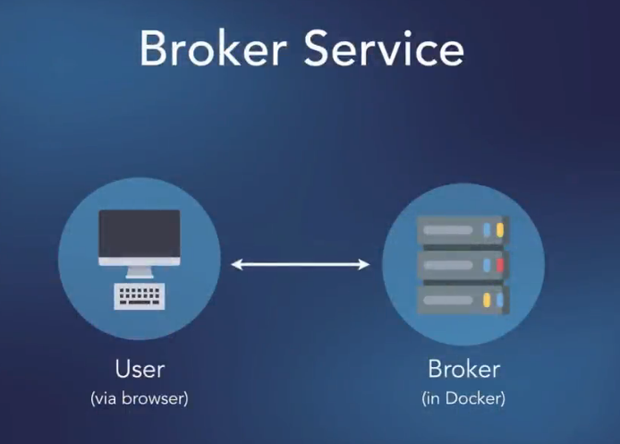
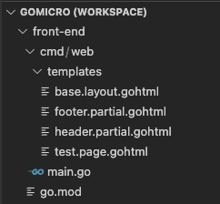
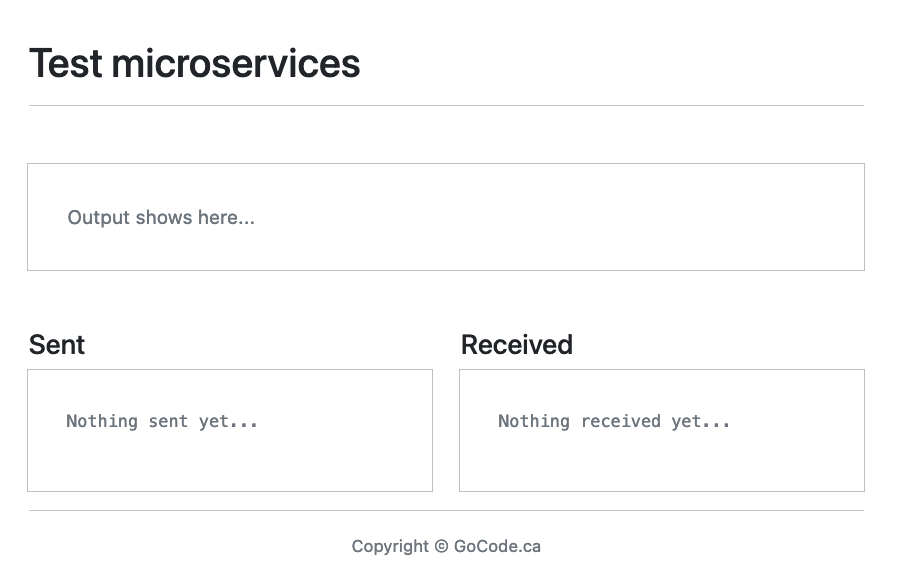
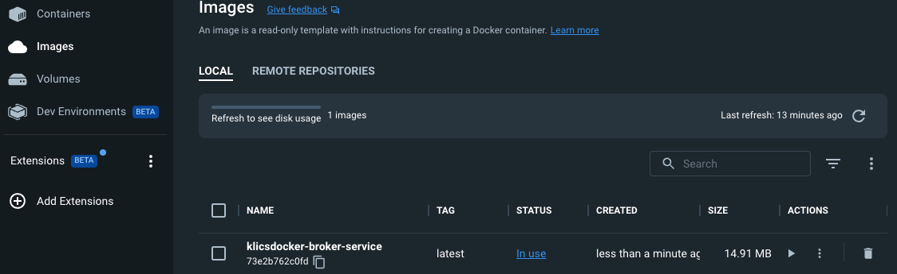
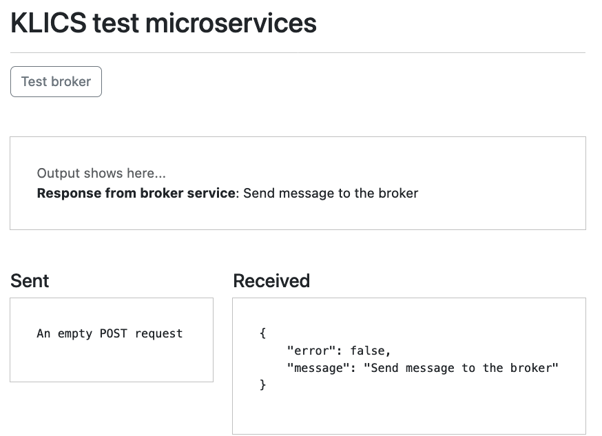

# Microservices with GO

## Bulding a simple front end and a microservice



**Feature:** Setup a a micro service called broker

    Scenario: I want to create a "broker-service"

    Scenario: I want to broker-service as a docker image to run in a docker container

    Scenario: Any code changes made to broker-service should automatically compile into a new docker image

**Feature:** Front-end interacrtion with broker-service

    Scenario: And I want to be able to modify the front-end to interact with broker-service

        When Front-end sends a request to broker-service

        And Broker-service processes the request

        And broker-service sends "some response" back

        Then I should see "some response" in the test-page

## Initial project structure



The workspace `GOMICRO` is saved at the root of our project folder

### Initialize GIT repository for version control

    ```bash
    git init
    git remote add origin git@github.com:cicio/MicroservicesGo.git
    git branch -U main
    git push -u origin main

    ```

Each service will be hosted in its separate folder and opened into the workspace. This will allow us to have all folders open at the same time

`go.mod` content shows that we are using go 1.18 version

**NOTE** research about upgrading to `go 1.20`

## The front-end

### The main.go file

    ```go
    http.HandleFunc("/", func(w http.ResponseWriter, r *http.Request) {
            render(w, "test.page.gohtml")
        })

    ```

We have one handler `HandleFunc`("/" ...)`

And as you can see in my main function, I define a handler and of course there's only one handler because

there's only one page on this particular site.

Any time someone hits slash the root level of this application, I'm going to call a render function

that renders the template named test.page.gohtml and that's found inside the `template` folder

### The test.page.gohtml

This uses the template base, which puts a header in here and it puts a footer down below everything else

`{{template "base" .}}`

And the content here is just simple HTML

`{{define "content"}}`

I'm using bootstrap and I have a div with the class of container.

Then I have one row and one column and at the top I have the title test microservices, then a horizontal rule.

    ```go

        <div class="container">
                <div class="row">
                    <div class="col">
                        <h1 class="mt-5">Test microservices</h1>
                        <hr>
    ```

Then it did that says output output shows here.

    ```
    <div id="output" class="mt-5" style="outline: 1px solid silver; padding: 2em;">
                    <span class="text-muted">Output shows here...</span>
                </div>
    ```

Obviously, we're going to change that using JavaScript.

And then I have two other windows or two little dialogs or boxes, one that shows what I'm sending and

    ```
     <div class="row">
            <div class="col">
                <h4 class="mt-5">Sent</h4>
                <div class="mt-1" style="outline: 1px solid silver; padding: 2em;">
                    <pre id="payload"><span class="text-muted">Nothing sent yet...</span></pre>
                </div>
            </div>
            <div class="col">
                <h4 class="mt-5">Received</h4>
                <div class="mt-1" style="outline: 1px solid silver; padding: 2em;">
                    <pre id="received"><span class="text-muted">Nothing received yet...</span></pre>
                </div>
            </div>
        </div>

    ```

one that shows what I'm receiving.

So that's simple HTML.

### The render function on the main.go file

    ```go
    func render(w http.ResponseWriter, t string) {

    partials := []string{
        "./cmd/web/templates/base.layout.gohtml",
        "./cmd/web/templates/header.partial.gohtml",
        "./cmd/web/templates/footer.partial.gohtml",
    }

    var templateSlice []string
    templateSlice = append(templateSlice, fmt.Sprintf("./cmd/web/templates/%s", t))

    for _, x := range partials {
        templateSlice = append(templateSlice, x)
    }

    tmpl, err := template.ParseFiles(templateSlice...)
    if err != nil {
        http.Error(w, err.Error(), http.StatusInternalServerError)
        return
    }

    if err := tmpl.Execute(w, nil); err != nil {
        http.Error(w, err.Error(), http.StatusInternalServerError)
    }


    ```

Once we have that slice of strings,

    ```go
    partials := []string{
        "./cmd/web/templates/base.layout.gohtml",
        "./cmd/web/templates/header.partial.gohtml",
        "./cmd/web/templates/footer.partial.gohtml",
    }
    ```

 we declare a variable called template slice, which is a slice of strings and we append whatever we received as an argument here called T for template.

    ```go
    var templateSlice []string
    templateSlice = append(templateSlice, fmt.Sprintf("./cmd/web/templates/%s", t))
    ```

We append that to this slice.

    ```go
    for _, x := range partials {
        templateSlice = append(templateSlice, x)
    }
    ```

So when I render that one page, it'll have based on layout HTML plus the header, plus the footer,

plus the name of the template that this function received.

And of course that was test.page.gohtml

Then all I do is pass those files using the template slices in argument, a veriadic parameter and I execute the template

    ```go
    tmpl, err := template.ParseFiles(templateSlice...)
    if err != nil {
        http.Error(w, err.Error(), http.StatusInternalServerError)
        return
    }

    if err := tmpl.Execute(w, nil); err != nil {
        http.Error(w, err.Error(), http.StatusInternalServerError)
    }

    ```

### The rendered test.page

Here is the view of the rendered test microservice page
run following command on the terminal

    ```bash
        go run ./cmd/web
    ```

    It should print out:
    
    `starting front end service on port 8081`



## Creating the broker-service

From the project rot folder `MicroservicesGo` creat a new `broker-service` folder
run following command from terminal

    ```bash
    cd broker-service
    go mod init github.com/cicio/Microservices/broker
    
    

    ```

### Folder structure

    ```bash
    Microservices
        broker-service
            cmd
                api
                    main.go
    ```

### First steps to creat the broker service

1. Has one route `"/"`

2. The top level of the application will work. It should accept Jason payload

3. Do something with it and then respond saying, `yeah, I've got the response`.

4. It should enable connection from the front end to the broker service

Get some third party library for routing

    ```go
        go get github.com/go-chi/chi/v5
        go get github.com/go-chi/chi/v5/middleware
        go get github.com/go-chi/cors
    ```

    Create a `routes.go` file that will host all routes for the application

    ```go
        func routes() http.Handler {

            mux := chi.NewRouter()

            //specify who is alloed to connect
            mux.Use(cors.Handler(cors.Options{
                AllowedOrigins:   []string{"https://*", "http://*"},
                AllowedMethods:   []string{"GET", "POST", "PUT", "DELETE", "OPTIONS"},
                AllowedHeaders:   []string{"Accept", "Authorization", "Content/Type", "X-CSRF-Token"},
                ExposedHeaders:   []string{"Link"},
                AllowCredentials: true,
                MaxAge:           300,
            }))

            mux.Use(middleware.Heartbeat("/ping"))

            return mux

        }
    ```

    Okay, so this will be a route, but I want to actually add a receiver here that allows me to share any configuration I might have from my application with routes when you need them. 
    On the `main.go` file

    ```go
// we will be using docker.
// And docker will listen on port 80 for any container
const webport = "80"

// declare a type config of type struct that will be receiver
// for the application
type Config struct{}

func main() {
// create a variable `app` of type config
    app := Config{}

    //create log to print
    log.Printf("Starting broker service on port %s", webport)

    //define an http server
    srv := &http.Server{
        Addr: fmt.Sprintf(":%s", webport),
    }

    // start the server
    err := srv.ListenAndServe()
    if err != nil {
        log.Panic(err)
}

}
    ```

Back at the `routes.go` file we will add `app` as a receiver for the `func routes() http.Handler {}`.

    ```go
    func (app *Config) routes() http.Handler

    ```
Then back at `main.go` we will add the second required field for the http server

    ```go


    ```

## Dockerize the current version of broker microservice

There are two ways we can do this

1. Multi-stage build using certified go docker image

    1.1. Create a Docker compose file that will run all micro services

    add a folder to host the docker compose file `KLICSDocker`
    Docker compose needs a docker file to run on.
    So at the `broker-service` folder create a docker file `broker-service.dockerfile`

    And this will be the Docker file that tells Docker compose how to build the image"

        ```docker
            # base go image
            FROM golang:1.20-alpine as builder

            RUN mkdir /app

            COPY . /app

            WORKDIR /app

            RUN CGO_ENABLED=0 go build brokerApp ./cmd/api

            RUN chmod +x /app/brokerApp

        ```

        The above code will build a docker image for the brokerApp

        The I will create a tiny image by copying from the `builder` but only with only the executable brokerApp

            ```dockerfile
            # build a tiny docker imnage
            FROM alpine:latest

            RUN mkdir /app

            COPY --from=builder /app/brokerApp /app

            CMD [ "/app/brokerApp" ]

            ```

            To make this dockerfile run, we must create a `docker-compose.yml` file in `KLICSDocker` folder

            ```yaml
            version: '3'

            services:

            broker-service:
                build:
                context: ./../broker-service
                dockerfile: ./../broker-service/broker-service.dockerfile
                restart: always
                ports:
                - "8080:80"
                deploy:
                mode: replicated
                replicas: 1

            ```

Now from the `KLICSDocker` folder run `docker-compose up -d`

We should get as final result following outpit on the terminal console

    ```bash
    [+] Running 2/2
    ⠿ Network klicsdocker_default             Created
    ⠿ Container klicsdocker-broker-service-1  Started      

    ```

    On the Docker Desktop we can see it running



## Add front-end functionality

Adding a Button and some messaging to make sure the fromt end is talking with the broker service, by passing JSON objects

1. Modify `test.page.gphtml`

    Ad Button `Test broker` <a id="brokerBtn" class="btn btn-outline-secondary" href="javascript:void(0);">Test broker</a>

    ```html
    <a id="brokerBtn" class="btn btn-outline-secondary" href="javascript:void(0);">Test broker</a>
    ```

2. Add Java script code to manipulate the DOM

    ```html
    {{define "js"}}
    <script>
    let brokerBtn = document.getElementById("brokerBtn");
    let output = document.getElementById("output");
    let sent = document.getElementById("payload");
    let received = document.getElementById("received");

    brokerBtn.addEventListener("click", function() {

        const body = {
            method: 'POST',
        }
        fetch("http:\/\/localhost:8080", body)
        .then((response) => response.json())
        .then((data) => {
            sent.innerHTML = "An empty POST request";
            received.innerHTML = JSON.stringify(data, undefined, 4);
            if (data.error) {
                console.log(data.message);
            } else {
                output.innerHTML += `<br><strong>Response from broker service</strong>: ${data.message}`;

            }
        })
        .catch((error) => {
            output.innerHTML += "<br><br>Error: " + error;
        })
    })
    </script>
    {{end}}
    ```

Browsing to `localhost:80` yields ths result:



## Creating some JSON helper functions to read and write json files

We will create a new file `helpers.go` in the broker-service folder

## Simplify handlers.go


## Use Make to simplify deploying and building docker images

place Makefilwe in the `KLICSDocker` folder

Edit the broker-service.`dockerfile` by eliminating the top creation of docker images. This task will be done now by the Makefile 

keep only

    ```bash

    FROM alpine:latest

    RUN mkdir /app

    COPY brokerApp /app

    CMD [ "/app/brokerApp" ]
    ```

from `KLICSDocker` folder run

`make up`
`up`: starts all containers in the background without forcing build

`make down`
`down`: stop docker compose

`make up_build`
`up_build`: stops docker-compose (if running), builds all projects and starts docker compose

more details on `Makefile`


